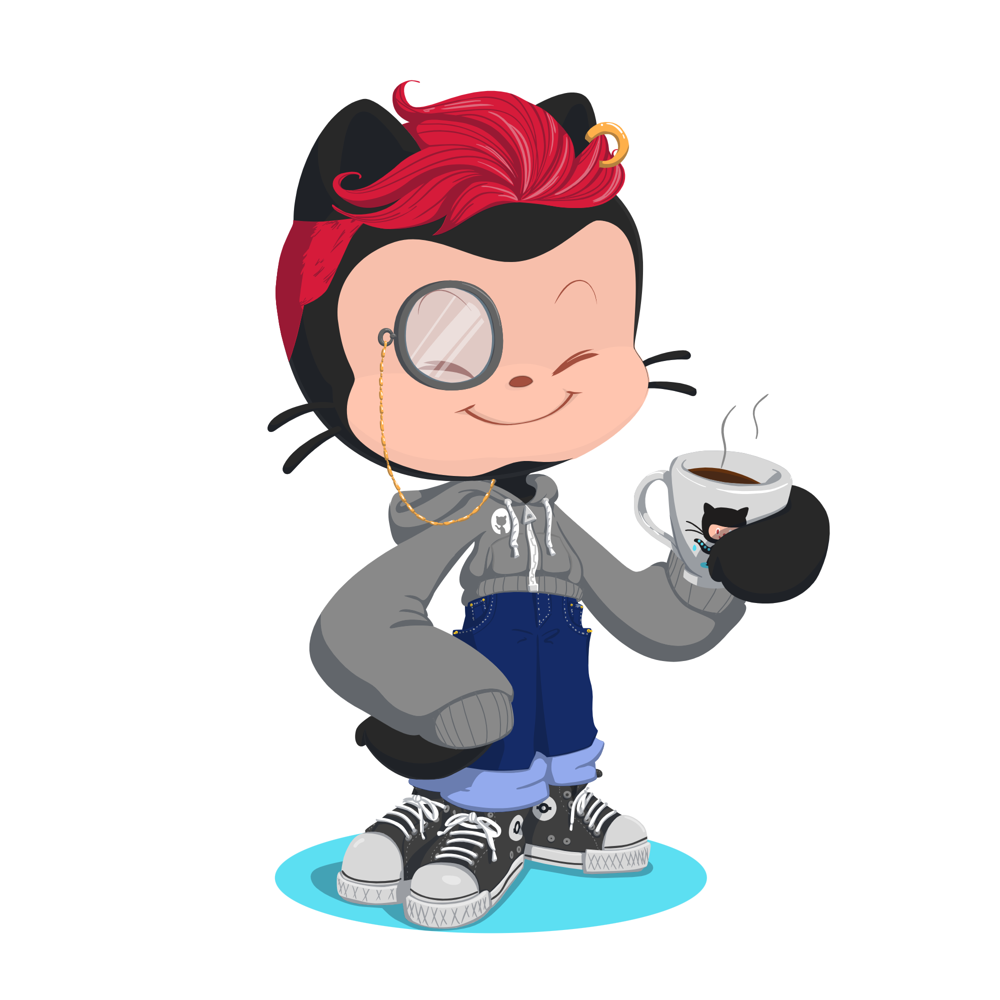

## Hi! I'm Bruna 👋

  

<!--  -->

- Internet Systems student.
- I’m interested in back-end development and robotics.
- Focused on improving my knowledge in C#, .NET, and Arduino.
- Passionate about exploring new places and connecting with new people.
- Completed a course in Logic Programming with JavaScript and Soft Skills from SENAC.
- Previous involvement in the Nova Geração project by Instituto Caldeira.

<i><b>feel free to contact me :)</i></b>

 

  
<b>PT/BR</b>

    <h2>Olá, eu sou a Bruna</h2>

- Estudante de Sistemas para Internet.
- Estou interessada em desenvolvimento back-end e robótica.
- Focada em aprimorar meu conhecimento em C#, .NET e Arduino.
- Adoro explorar novos lugares e conhecer novas pessoas.
- Participante do desafio "100 dias de código" pela Comunidade He4rt Developers. Compartilhando meu progresso no Twitter.
- Tenho formação no curso de Lógica de Programação com JavaScript e Soft Skills do SENAC RS.
- Participei do Projeto Nova Geração do Instituto Caldeira.

<i><b>sinta-se livre para me contatar :)</i></b>

 

 
  <!--  -->
   
  

##
 
 
  <a href="https://github.com/BrunaGPires">
  
  
  <!---->

 
  
  
  
  
  
  
  

