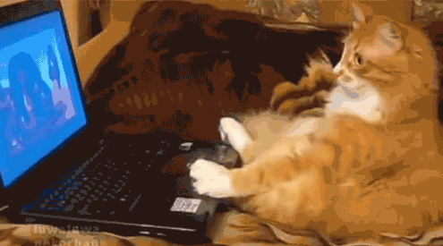

## Hi! I'm Bruna 👋

  

- Internet Systems student.
- Aspiring backend developer.
- Focusing on improving my knowledge in C# and .NET.
- Passionate about exploring new places and connecting with new people.
- Participant in the "100 days of code" challenge by He4rt Developers. Sharing my journey and progress on Twitter.
- Currently enrolled in the WEX bootcamp - .NET Development and QA at DIO.
- Previous involvement in the Nova Geração project by Instituto Caldeira.

<i><b>feel free to contact me :)</i></b>

 

  
<b>PT/BR</b>

    <h2>Olá, eu sou a Bruna</h2>

- Estudante de Sistemas para Internet.
- Estou interessada em desenvolvimento back-end.
- Focada em aprimorar meu conhecimento em C# e .NET.
- Adoro explorar novos lugares e conhecer novas pessoas.
- Participante do desafio "100 dias de código" pela Comunidade He4rt Developers. Compartilhando meu progresso no Twitter.
- Atualmente matriculado no bootcamp WEX - Desenvolvimento .NET e QA da DIO.
- Participei do Projeto Nova Geração do Instituto Caldeira.

<i><b>sinta-se livre para me contatar :)</i></b>

 

 
  
   
   
  

##

 

  <a href="https://github.com/BrunaGPires">
  
  

 
  
  
  
  
  
  

  
